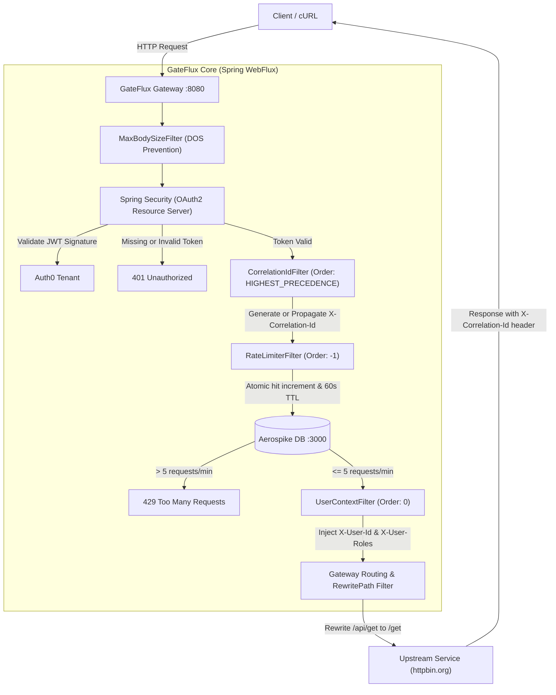

# GateFlux

GateFlux is a reactive API Gateway built with Spring Boot and Spring Cloud Gateway (WebFlux). It acts as a reverse proxy fronting backend services, providing OAuth2 JWT authentication, distributed per-IP rate limiting powered by Aerospike, distributed tracing correlation IDs, and downstream JWT claim enrichment.

---

## Architecture

GateFlux operates on a non-blocking Netty runtime. Every inbound request passes through security validation, distributed tracing, rate limiting, and user context enrichment before reaching upstream destinations.



### Core Components

- **Spring WebFlux & Netty**: Non-blocking event loop runtime for high-throughput request handling with Slowloris header timeout handlers and read/idle timeouts.
- **Spring Security (OAuth2 Resource Server)**: Validates incoming Bearer JWT tokens against the Auth0 issuer without holding local session state.
- **Distributed Tracing (`CorrelationIdFilter`)**: A global filter that inspects requests for `X-Correlation-Id`. If missing, it generates a fresh UUID. It forwards the ID downstream and attaches it to the client HTTP response headers.
- **Aerospike Rate Limiter (`RateLimiterFilter`)**: A reactive global filter that extracts client IP addresses, issues atomic increments to Aerospike, and enforces a sliding 60-second TTL window (max 5 requests/minute).
- **User Context Enrichment (`UserContextFilter`)**: Extracts the subject and granted authorities from the reactive SecurityContext, injecting `X-User-Id` and `X-User-Roles` headers for downstream services to avoid redundant token parsing.
- **Gateway Routing (`application.yaml`)**: Matches incoming paths, rewrites URI segments, and proxies downstream traffic.

---

## Prerequisites

- **Java Development Kit (JDK)**: Version 21 or higher (tested with Java 23).
- **Docker or Podman**: To run the local Aerospike container.
- **Auth0 Account**: For issuing JWT access tokens.

---

## Getting Started

### 1. Start the Aerospike Container

Start an Aerospike instance on localhost using Podman or Docker:

```bash
# If the container was already created
podman start aerospike

# Or create a new container
podman run -d --name aerospike -p 3000:3000 -p 3001:3001 -p 3002:3002 aerospike/aerospike-server:latest
```

### 2. Start the Gateway Application

Run the Spring Boot application using the bundled Maven wrapper:

```bash
./mvnw spring-boot:run
```

The gateway listens on `http://localhost:8080`.

---

## Obtaining an Auth0 Token

Protected endpoints require a valid JWT issued by Auth0.

1. In the [Auth0 Dashboard](https://manage.auth0.com/), navigate to **Applications** > **APIs**.
2. Select **Gateflux Gateway** (audience: `https://gateflux.api`).
3. Open the **Test** tab.
4. Copy the temporary token under **Response**, or request a token directly via cURL:

```bash
curl --request POST \
  --url https://dev-2gw1uaqrtf1w7k5s.us.auth0.com/oauth/token \
  --header 'content-type: application/json' \
  --data '{"client_id":"<YOUR_CLIENT_ID>","client_secret":"<YOUR_CLIENT_SECRET>","audience":"https://gateflux.api","grant_type":"client_credentials"}'
```

Save the access token to your environment:

```bash
export TOKEN="<YOUR_ACCESS_TOKEN>"
```

---

## Demo & Verification Commands

Use the following cURL commands to test and demo the core gateway features:

### 1. Actuator Health (Public Endpoint)
Verifies the gateway is running and healthy without requiring authorization:

```bash
curl -i http://localhost:8080/actuator/health
```

**Expected response**:
```http
HTTP/1.1 200 OK
Content-Type: application/vnd.spring-boot.actuator.v3+json

{"groups":["liveness","readiness"],"status":"UP"}
```

---

### 2. Authentication Enforcement (Unauthenticated Request)
Demonstrates that protected routes reject unauthorized requests:

```bash
curl -i http://localhost:8080/api/get
```

**Expected response**:
```http
HTTP/1.1 401 Unauthorized
WWW-Authenticate: Bearer
```

---

### 3. Proxy Routing & Downstream Header Enrichment (Authenticated Request)
Demonstrates JWT validation, path rewriting (`/api/get` -> `/get`), forwarding to `httpbin.org`, and header enrichment (`X-Correlation-Id`, `X-User-Id`, `X-User-Roles`):

```bash
curl -i -H "Authorization: Bearer $TOKEN" http://localhost:8080/api/get
```

**Expected response**:
The HTTP response headers include `X-Correlation-Id`, and the body echoes enriched headers received by `httpbin.org`:
```http
HTTP/1.1 200 OK
X-Correlation-Id: 550e8400-e29b-41d4-a716-446655440000
Content-Type: application/json

{
  "headers": {
    "Host": "httpbin.org",
    "X-Correlation-Id": "550e8400-e29b-41d4-a716-446655440000",
    "X-User-Id": "VGrL7AOnyyITWraporjdBchmdBe0hykR@clients",
    "X-User-Roles": "read:users",
    ...
  },
  "url": "https://httpbin.org/get"
}
```

---

### 4. Distributed Tracing Propagation (Custom Correlation ID)
Demonstrates that if a client or upstream service passes an existing correlation ID, the gateway preserves and propagates it:

```bash
curl -i -H "Authorization: Bearer $TOKEN" -H "X-Correlation-Id: custom-trace-12345" http://localhost:8080/api/get
```

**Expected response**:
Both the response header and the echoed upstream headers reflect `custom-trace-12345`.

---

### 5. Distributed Rate Limiting (Aerospike Integration)
Demonstrates the 5-requests-per-minute threshold. The first 5 requests succeed, and the 6th is rejected:

```bash
for i in {1..6}; do curl -s -o /dev/null -w "%{http_code}\n" -H "Authorization: Bearer $TOKEN" http://localhost:8080/api/get; done
```

**Expected output**:
```text
200
200
200
200
200
429
```

The rate limit window resets 60 seconds after the first request.

---

## Project Structure

```text
gateflux/
├── src/main/java/com/resume/gateflux/
│   ├── GatefluxApplication.java   # Spring Boot application entry point
│   ├── CorrelationIdFilter.java   # Distributed tracing and correlation ID propagation
│   ├── HeaderTimeoutHandler.java  # Netty slowloris header timeout enforcement
│   ├── MaxBodySizeFilter.java     # Request body payload limit filter
│   ├── NettyServerConfig.java     # Netty server customization (timeouts, idle limits)
│   ├── RateLimiterFilter.java     # Global filter integrating Aerospike for IP rate limits
│   ├── SecurityConfig.java        # WebFlux security filter chain & JWT decoder setup
│   └── UserContextFilter.java     # Downstream user identity enrichment (X-User-Id, X-User-Roles)
├── src/main/resources/
│   └── application.yaml           # Gateway routes, Aerospike hosts, and OAuth2 issuer config
└── pom.xml                        # Maven dependencies (Spring Cloud Gateway, Aerospike Starter)
```
